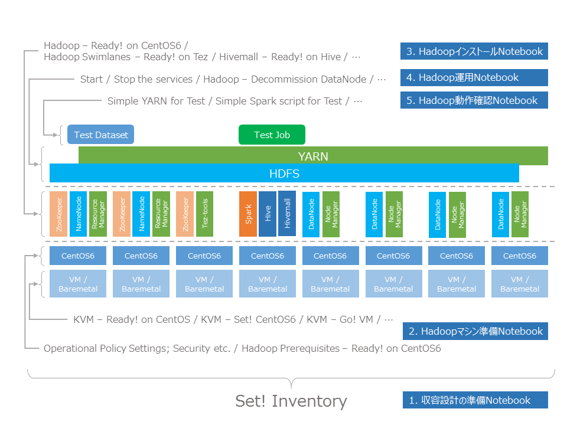
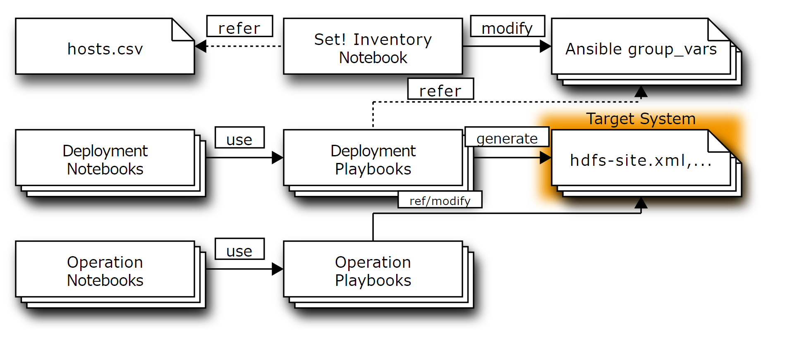

# About: Notebooks for Hadoop Clusters README

Literate Computing for Reproducible Infrastructure: インフラ運用をJupyter + Ansibleでおこなう際のお手本Notebookです。(Hadoop版)

このリポジトリでは、HDP(Hortonworks Data Platform, https://jp.hortonworks.com/products/data-center/hdp/ )を利用してHadoopクラスタを構築し、運用するためのNotebook例を紹介しています。

**なお、これらのNotebookはNIIクラウドチーム内で行っている作業の考え方を示すためのもので、環境によってはそのままでは動作しないものもあります。**

----

[](http://creativecommons.org/licenses/by/4.0/)

Literate-computing-Hadoop (c) by National Institute of Informatics

Literate-computing-Hadoop is licensed under a
Creative Commons Attribution 4.0 International License.

You should have received a copy of the license along with this
work. If not, see <http://creativecommons.org/licenses/by/4.0/>.

## 関連資料


- [Jupyter notebook を用いた文芸的インフラ運用のススメ - SlideShare](http://www.slideshare.net/nobu758/jupyter-notebook-63167604)
- [Literate Automation（文芸的自動化）についての考察 - めもめも](http://enakai00.hatenablog.com/entry/2016/04/22/204125)


# お手本Notebook

お手本NotebookはこのNotebookと同じディレクトリにあります。Notebookは目的に応じて以下のような命名規則に則って名前がつけられています。

- D(NN)\_(Notebook名) ... インストール関連Notebook
- O(NN)\_(Notebook名) ... 運用関連Notebook
- T(NN)\_(Notebook名) ... テスト関連Notebook

特に、**[D00_Prerequisites for Literate Computing via Notebooks](D00_Prerequisites for Literate Computing via Notebooks.ipynb)は、お手本Notebookが適用可能なNotebook環境、Bind対象であるかどうかを確認するためのNotebook**です。はじめに実施して、これらのお手本Notebookが利用可能な状態かを確認してみてください。

## お手本Notebookの構成

このNotebookは、大きく分けて以下のような構成になっています。

1. 収容設計の準備Notebook
2. Hadoopマシン準備Notebook
3. HadoopインストールNotebook
4. Hadoop運用Notebook
5. Hadoop動作確認Notebook

これらのNotebookと、構築・運用する対象の関係は、以下のようになります。



*収容設計の準備Notebook* は、構築・運用対象とするシステム全体の収容設計をおこないます。ここで、どのようなマシンがあって(あるいは用意する必要があって)、それぞれのマシンにどのような役割を割り当てるかを明確化します。このプロセスによりAnsibleのInventory, 変数群を生成します。**ここで、Ansibleなど自動化ツールに与えるパラメータと、収容設計の関連を明確化**します。

*Hadoopマシン準備Notebook* は、Hadoopのインストール対象のマシンを準備し、**Hadoop(HDP)のインストールに必要な前提条件を満たすよう各マシンのOS設定を調整**します。それぞれの要件については各Notebookを参照してください。

*HadoopインストールNotebook* は、Hadoopおよびその周辺ツールのインストール手順を定義します。マシンの準備Notebookにより**前提条件が満たされた状態のマシンに対して各種ツールをインストールする**ことができます。

*Hadoop運用Notebook* は、構築した環境を保守する手順を定義します。実際にクラスタを構築すると、ハードウェア故障が生じたりさまざまなトラブルが発生するので、それらの状態変化に応じてクラスタの健康状態を維持する必要があります。**公開したこれらのNotebookは運用における手順や考え方を紹介する一例であり、障害の具体的な発生状況に応じて修正しながら実施する必要があります。**

*Hadoop動作確認Notebook* は、構築した環境に実際にデータをアップロードしてみたり、ジョブを実行してみたりする例を提供します。**HadoopインストールNotebookを通してインストールされた環境の使い方**を示す役割もあります。

### 収容設計の準備Notebook

Hadoopのように複数ノードからなるクラスタを構築・運用する際は、それぞれのノードにどのようなロール(役割)を割り振って、リソースを割り当てていくか(収容設計)が重要なポイントになります。収容設計を明確にしながらシステムを構築・運用していくことで、的確なシステムのスケールや、スムーズなトラブル対応をすることが可能になります。

そこで、インストールの前に以下のNotebookにより、収容設計の確認をしながら、AnsibleのInventoryやgroup_varsといった各種パラメータを生成しています。

- [D10_Hadoop - Set! Inventory](D10_Hadoop - Set! Inventory.ipynb)


ここで生成されるパラメータは、以降の手順のNotebookで設定ファイル生成の際に利用されます。


[](http://interactive.blockdiag.com/?compression=deflate&encoding=base64&src=eJyFk0FPhDAQhe_7K-peuLCoN5MVExMvXtRkvenGFDpAQ2lJO0tEs__dFkxoEOp5Zt57-V4mEyqvGacl-d4QUimDJslNR95MRVtIpUI47u0kOgBekEfZgUSl-3f5ZCeZUnU0TO-l4ZkAUmp1aj86qk1kJZDmNbB4LvUArVB9Y5UmGW__79KLoP3iUsUKszMcIflsRJwkiedK5rbPLWiKXMmAq7ezZjoxut0FsLijXkDKFKJNI2gGItVQgP6HJ9ndrfAcNRrFeNEfV7G7VGvwvBRxoQRz5Xgpg_W4WGHdk1ko2FtzCkuNjdclSMcebDCJhn9Ben0VKs6prdQ1i7Pg6SAFjyML6XJEHU2Jbn6pDboD9OFtCBmPtq9Ul4Dk0BuEZrsfRgv2bnDenH8AoFQymA)

ここで定義されるパラメータには、以下のようなものがあります。

- 各サービスに割り当てるリソース量の情報
- 各サービスのインストールに使用する外部リソースの情報

Hadoop構築Notebookでは、各マシンにどのサービスを載せて、どの程度のメモリやディスクを割り当てていくかは、 [hosts.csv](hosts.csv) のような表形式で定義しています。この情報に基づいて、AnsibleのPlaybookに与えるパラメータを定義しています。

また、Hadoopのインストール時にどのリポジトリからパッケージを取ってくるかという情報も、システムの素性を理解するうえで重要な情報です。このような情報も含めてNotebookの形で明確化、証跡を残すようにしています。

### Hadoopマシン準備Notebook

Hadoopをインストールする対象となるマシンの準備に関するNotebookです。

#### VMの作成手順

NIIクラウドチームでは、プライベートなベアメタルクラウド(仮想マシンではなく物理マシンを貸すIaaS)を持っています。このクラウド上でベアメタル(物理マシン)を複数台用意し、そこにHadoopをインストールする形を採っています。
ベアメタルの設定手順の事例紹介は難しいのですが、テスト用クラスタを構築する際に使っているKVM環境の準備と、VMの構築用Notebookをここでは紹介しています。

この例では、以下のものを準備しています。

- [D03_KVM - Ready! on CentOS](D03_KVM - Ready! on CentOS.ipynb)
- [D03b_KVM - Set! CentOS6](D03b_KVM - Set! CentOS6.ipynb)
- [D03c_KVM - Go! VM](D03c_KVM - Go! VM.ipynb)


また、Google Compute Engineでのマシン確保を想定したNotebookも添付しています。

- [D01_GCE - Set! Go! (Google Compute Engine)](D01_GCE - Set! Go! %28Google Compute Engine%29.ipynb)
- [O03_GCE - Destroy VM (Google Compute Engine)](O03_GCE - Destroy VM %28Google Compute Engine%29.ipynb)

#### VMの設定手順

作成したVMは、MinimalなOSがインストールされた状態ですので、(当然のことながら)セキュリティ上必要な設定を施す必要があります。

- [D90_Postscript - Operational Policy Settings; Security etc. (to be elaborated)](D90_Postscript - Operational Policy Settings; Security etc. %28to be elaborated%29.ipynb)

また、HDPをインストールするために必要な推奨設定などもあります。これらの設定を施すNotebookも紹介しています。

- [D11_Hadoop Prerequisites - Ready! on CentOS6](D11_Hadoop Prerequisites - Ready! on CentOS6.ipynb)

これらの設定としてどのような項目が必要かは、VMの初期設定により異なってきます。

### HadoopインストールNotebook

Hadoopのインストールは以下のような手順で実施しています。
HDPで提供されていないものについては、HDPインストール用Notebookとは別にNotebookを用意しています。

- [D12_Hadoop - Ready! on CentOS6 - ZK,HDFS,YARN,HBase,Hive,Spark](D12_Hadoop - Ready! on CentOS6 - ZK,HDFS,YARN,HBase,Hive,Spark.ipynb)
- [D13a_Hadoop Swimlanes - Ready! on Tez](D13a_Hadoop Swimlanes - Ready! on Tez.ipynb)
- [D13b_Hivemall - Ready! on Hive](D13b_Hivemall - Ready! on Hive.ipynb)

### Hadoop運用Notebook

Hadoopの運用に関しては、以下のようなNotebookを用意しています。

- [O12a_Hadoop - Start the services - ZK,HDFS,YARN,HBase,Spark](O12a_Hadoop - Start the services - ZK,HDFS,YARN,HBase,Spark.ipynb)
- [O12b_Hadoop - Stop the services - Spark,HBase,YARN,HDFS,ZK](O12b_Hadoop - Stop the services - Spark,HBase,YARN,HDFS,ZK.ipynb)
- [O12c_Hadoop - Decommission DataNode](O12c_Hadoop - Decommission DataNode.ipynb)
- [O12d_Hadoop - Restore a Slave Node](O12d_Hadoop - Restore a Slave Node.ipynb)


### Hadoop動作確認Notebook

動作確認のためのNotebookとして、以下のものを用意しています。

- [T12a_Hadoop - Confirm the services are alive - ZK,HDFS,YARN,HBase,Spark](T12a_Hadoop - Confirm the services are alive - ZK,HDFS,YARN,HBase,Spark.ipynb)
- [T12b_Hadoop - Simple YARN for Test job](T12b_Hadoop - Simple YARN job for Test.ipynb)
- [T12c_Hadoop - Simple HBase query for Test.ipynb](T12c_Hadoop - Simple HBase query for Test.ipynb)
- [T12d_Hadoop - Simple Spark script for Test](T12d_Hadoop - Simple Spark script for Test.ipynb)
- [T13b_Hadoop - Simple Hivemall query for Test](T13b_Hadoop - Simple Hivemall query for Test.ipynb)

## お手本Notebookの一覧

現在、このNotebook環境からアクセス可能なNotebookの一覧を参照するには、以下のセルを実行(`Run cell`)してください。Notebookファイルへのリンクが表示されます。


```python
import re
import os
from IPython.core.display import HTML

ref_notebooks = filter(lambda m: m, map(lambda n: re.match(r'([A-Z][0-9][0-9a-z]+_.*)\.ipynb', n), os.listdir('.')))
ref_notebooks = sorted(ref_notebooks, key=lambda m: m.group(1))
HTML(''.join(map(lambda m: '<div><a href="{name}" target="_blank">{title}</a></div>'.format(name=m.group(0), title=m.group(1)),
                 ref_notebooks)))
```


<div><a href="D00_Prerequisites for Literate Computing via Notebooks.ipynb" target="_blank">D00_Prerequisites for Literate Computing via Notebooks</a></div><div><a href="D01_GCE - Set! Go! (Google Compute Engine).ipynb" target="_blank">D01_GCE - Set! Go! (Google Compute Engine)</a></div><div><a href="D03_KVM - Ready! on CentOS.ipynb" target="_blank">D03_KVM - Ready! on CentOS</a></div><div><a href="D03b_KVM - Set! CentOS6.ipynb" target="_blank">D03b_KVM - Set! CentOS6</a></div><div><a href="D03c_KVM - Go! VM.ipynb" target="_blank">D03c_KVM - Go! VM</a></div><div><a href="D10_Hadoop - Set! Inventory.ipynb" target="_blank">D10_Hadoop - Set! Inventory</a></div><div><a href="D11_Hadoop Prerequisites - Ready! on CentOS6.ipynb" target="_blank">D11_Hadoop Prerequisites - Ready! on CentOS6</a></div><div><a href="D12_Hadoop - Ready! on CentOS6 - ZK,HDFS,YARN,HBase,Hive,Spark.ipynb" target="_blank">D12_Hadoop - Ready! on CentOS6 - ZK,HDFS,YARN,HBase,Hive,Spark</a></div><div><a href="D13a_Hadoop Swimlanes - Ready! on Tez.ipynb" target="_blank">D13a_Hadoop Swimlanes - Ready! on Tez</a></div><div><a href="D13b_Hivemall - Ready! on Hive.ipynb" target="_blank">D13b_Hivemall - Ready! on Hive</a></div><div><a href="D90_Postscript - Operational Policy Settings; Security etc. (to be elaborated).ipynb" target="_blank">D90_Postscript - Operational Policy Settings; Security etc. (to be elaborated)</a></div><div><a href="O03_GCE - Destroy VM (Google Compute Engine).ipynb" target="_blank">O03_GCE - Destroy VM (Google Compute Engine)</a></div><div><a href="O03_KVM - Destroy VM on KVM.ipynb" target="_blank">O03_KVM - Destroy VM on KVM</a></div><div><a href="O12a_Hadoop - Start the services - ZK,HDFS,YARN,HBase,Spark.ipynb" target="_blank">O12a_Hadoop - Start the services - ZK,HDFS,YARN,HBase,Spark</a></div><div><a href="O12b_Hadoop - Stop the services - Spark,HBase,YARN,HDFS,ZK.ipynb" target="_blank">O12b_Hadoop - Stop the services - Spark,HBase,YARN,HDFS,ZK</a></div><div><a href="O12c_Hadoop - Decommission DataNode.ipynb" target="_blank">O12c_Hadoop - Decommission DataNode</a></div><div><a href="O12d_Hadoop - Restore a Slave Node.ipynb" target="_blank">O12d_Hadoop - Restore a Slave Node</a></div><div><a href="T03_KVM - Confirm KVM is healthy .ipynb" target="_blank">T03_KVM - Confirm KVM is healthy </a></div><div><a href="T03_KVM - Status Report of running VMs.ipynb" target="_blank">T03_KVM - Status Report of running VMs</a></div><div><a href="T12a_Hadoop - Confirm the services are alive - ZK,HDFS,YARN,HBase,Spark.ipynb" target="_blank">T12a_Hadoop - Confirm the services are alive - ZK,HDFS,YARN,HBase,Spark</a></div><div><a href="T12b_Hadoop - Simple YARN job for Test.ipynb" target="_blank">T12b_Hadoop - Simple YARN job for Test</a></div><div><a href="T12c_Hadoop - Simple HBase query for Test.ipynb" target="_blank">T12c_Hadoop - Simple HBase query for Test</a></div><div><a href="T12d_Hadoop - Simple Spark script for Test.ipynb" target="_blank">T12d_Hadoop - Simple Spark script for Test</a></div><div><a href="T13b_Hadoop - Simple Hivemall query for Test.ipynb" target="_blank">T13b_Hadoop - Simple Hivemall query for Test</a></div>


## お手本Notebookと証跡Notebook

お手本Notebookを使う場合は、お手本をコピーし、そのコピーを開きます。このように、**お手本と作業証跡は明確に分けながら作業をおこないます。**

また、お手本をコピーする際は、 `YYYYMMDD_NN_` といった実施日を示すプレフィックスを付加することで、後で整理しやすくしています。

## 実際にお手本Notebookを使ってみる

以下のJavaScriptを実行することで、簡単にお手本から作業用Notebookを作成することもできます。

以下のセルを実行すると、Notebook名のドロップダウンリストと[作業開始]ボタンが現れます。
[作業開始]ボタンを押すと、お手本Notebookのコピーを作成した後、自動的にブラウザでコピーが開きます。
Notebookの説明を確認しながら実行、適宜修正しながら実行していってください。


```python
from datetime import datetime
import shutil

def copy_ref_notebook(src):
    prefix = datetime.now().strftime('%Y%m%d') + '_'
    index = len(filter(lambda name: name.startswith(prefix), os.listdir('.'))) + 1
    new_notebook = '{0}{1:0>2}_{2}'.format(prefix, index, src)
    shutil.copyfile(src, new_notebook)
    print(new_notebook)

frags = map(lambda m: '<option value="{name}">{title}</option>'.format(name=m.group(0), title=m.group(1)),
            ref_notebooks)
HTML('''
<script type="text/Javascript">
    function copy_otehon() {
        var sel = document.getElementById('selector');
        IPython.notebook.kernel.execute('copy_ref_notebook("' + sel.options[sel.selectedIndex].value + '")',
                       {'iopub': {'output': function(msg) {
                           window.open(msg.content.text, '_blank')
                       }}});
    }
</script>
<select id="selector">''' + ''.join(frags) + '</select><button onclick="copy_otehon()">作業開始</button>')
```


<script type="text/Javascript">
    function copy_otehon() {
        var sel = document.getElementById('selector');
        IPython.notebook.kernel.execute('copy_ref_notebook("' + sel.options[sel.selectedIndex].value + '")',
                       {'iopub': {'output': function(msg) {
                           window.open(msg.content.text, '_blank')
                       }}});
    }
</script>
<select id="selector"><option value="D00_Prerequisites for Literate Computing via Notebooks.ipynb">D00_Prerequisites for Literate Computing via Notebooks</option><option value="D01_GCE - Set! Go! (Google Compute Engine).ipynb">D01_GCE - Set! Go! (Google Compute Engine)</option><option value="D03_KVM - Ready! on CentOS.ipynb">D03_KVM - Ready! on CentOS</option><option value="D03b_KVM - Set! CentOS6.ipynb">D03b_KVM - Set! CentOS6</option><option value="D03c_KVM - Go! VM.ipynb">D03c_KVM - Go! VM</option><option value="D10_Hadoop - Set! Inventory.ipynb">D10_Hadoop - Set! Inventory</option><option value="D11_Hadoop Prerequisites - Ready! on CentOS6.ipynb">D11_Hadoop Prerequisites - Ready! on CentOS6</option><option value="D12_Hadoop - Ready! on CentOS6 - ZK,HDFS,YARN,HBase,Hive,Spark.ipynb">D12_Hadoop - Ready! on CentOS6 - ZK,HDFS,YARN,HBase,Hive,Spark</option><option value="D13a_Hadoop Swimlanes - Ready! on Tez.ipynb">D13a_Hadoop Swimlanes - Ready! on Tez</option><option value="D13b_Hivemall - Ready! on Hive.ipynb">D13b_Hivemall - Ready! on Hive</option><option value="D90_Postscript - Operational Policy Settings; Security etc. (to be elaborated).ipynb">D90_Postscript - Operational Policy Settings; Security etc. (to be elaborated)</option><option value="O03_GCE - Destroy VM (Google Compute Engine).ipynb">O03_GCE - Destroy VM (Google Compute Engine)</option><option value="O03_KVM - Destroy VM on KVM.ipynb">O03_KVM - Destroy VM on KVM</option><option value="O12a_Hadoop - Start the services - ZK,HDFS,YARN,HBase,Spark.ipynb">O12a_Hadoop - Start the services - ZK,HDFS,YARN,HBase,Spark</option><option value="O12b_Hadoop - Stop the services - Spark,HBase,YARN,HDFS,ZK.ipynb">O12b_Hadoop - Stop the services - Spark,HBase,YARN,HDFS,ZK</option><option value="O12c_Hadoop - Decommission DataNode.ipynb">O12c_Hadoop - Decommission DataNode</option><option value="O12d_Hadoop - Restore a Slave Node.ipynb">O12d_Hadoop - Restore a Slave Node</option><option value="T03_KVM - Confirm KVM is healthy .ipynb">T03_KVM - Confirm KVM is healthy </option><option value="T03_KVM - Status Report of running VMs.ipynb">T03_KVM - Status Report of running VMs</option><option value="T12a_Hadoop - Confirm the services are alive - ZK,HDFS,YARN,HBase,Spark.ipynb">T12a_Hadoop - Confirm the services are alive - ZK,HDFS,YARN,HBase,Spark</option><option value="T12b_Hadoop - Simple YARN job for Test.ipynb">T12b_Hadoop - Simple YARN job for Test</option><option value="T12c_Hadoop - Simple HBase query for Test.ipynb">T12c_Hadoop - Simple HBase query for Test</option><option value="T12d_Hadoop - Simple Spark script for Test.ipynb">T12d_Hadoop - Simple Spark script for Test</option><option value="T13b_Hadoop - Simple Hivemall query for Test.ipynb">T13b_Hadoop - Simple Hivemall query for Test</option></select><button onclick="copy_otehon()">作業開始</button>


## お手本のアーカイブ

以下のセルで、お手本NotebookのZIPアーカイブを作成できます。


```python
ref_notebooks = filter(lambda m: m, map(lambda n: re.match(r'([A-Z][0-9][0-9a-z]+_.*)\.ipynb', n), os.listdir('.')))
ref_notebooks = sorted(ref_notebooks, key=lambda m: m.group(1))
!zip ref_notebooks-{datetime.now().strftime('%Y%m%d')}.zip README.ipynb hosts.csv {' '.join(map(lambda n: '"' + n.group(0) + '"', ref_notebooks))} scripts/* images/* group_vars/.gitkeep
```

こいつを・・・以下のURLからダウンロードできます。


```python
HTML('<a href="../files/{filename}" target="_blank">{filename}</a>' \
     .format(filename='ref_notebooks-' + datetime.now().strftime('%Y%m%d') + '.zip'))
```


```python

```
